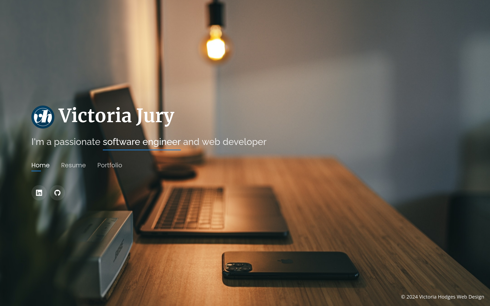

# python_django_portfolio

Project to familiarise myself with the Django web framework. This project will be a portfolio website to showcase my other website projects and CV.




I followed the tutorial at <https://realpython.com/get-started-with-django-1/> to get started.

## Requirements

- Python 3.11+
- pip
- pipenv

## Installation

To install dependencies from `Pipfile`, run:

```bash
pipenv install
```

and apply migrations to set up the SQLite3 database:

```bash
python manage.py migrate
```

## Usage

To run the server, enter `pipenv shell` and run:

```bash
python manage.py runserver
```

## Run the tests

To run the tests, enter `pipenv shell` and run:

```bash
python manage.py test
```
